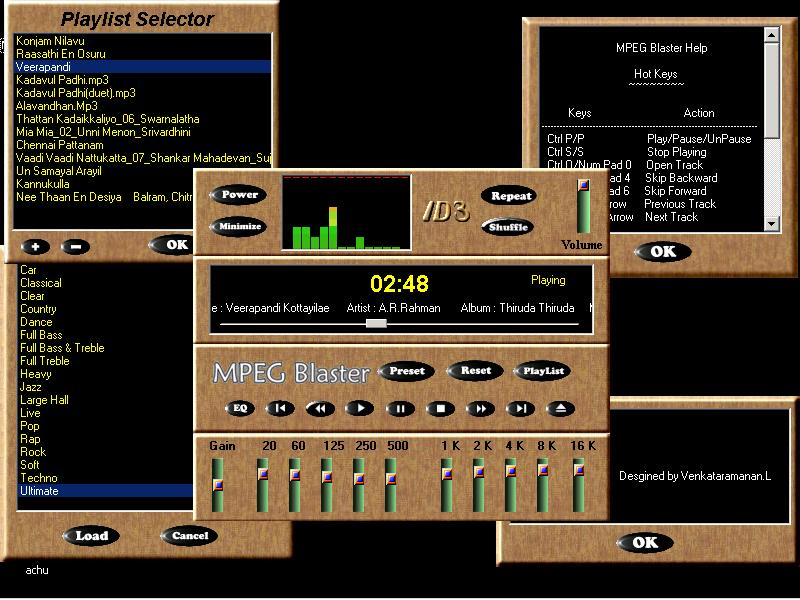



## MPEG Blaster Upgrade \[with Mirror Site\]\.\.\.

### Description

MPEG Blaster is a MP3 Player built with the Impulse MP3 Control. MPEG Blaster comes with a Easy to Use Interface, 10 Band Graphic Equalizer, Easy to Use Playlist Editor, 18 Preset Effects, Global Volume Control which Controls the Master Volume Control of the Windows Mixer, Completely Skinnable and comes with 6 Inbuilt Skins, Customizable Preset Eqaulizer Format (PEQ) using Which you can set your own Equalizer settings, 6 Different Types of Visualizations, Sits in the Taskbar for Easy Access, Completely Controllable with the Keyboard for Easy Access Using Hot Keys, ID3 Info Scrolls in the Main Display and in Taskbar (like Winamp) and many more cool features... If you've any doubts or if you need to report any bug in this Program, feel free to mail me in the mail id lvramanan@yahoo.com or lvramanan@hotmail.com. You are free to make any changes or enhancements to MPEG Blaster. And if it is working Properly and you wish to add that to MPEG Blaster please send the same To get the Latest Version of MPEG Blaster and to get Online Information about MPEG Blaster visit the Online Site http://www.geocities.com/lvramanan for more Info.

Supported Platforms:

----

Windows 9x, Windows Me, Windows NT, Windows 2000.

Minimum Requirements:

----

* A Wave Playback Compatiable Sound Card (16 bit Recommended for Best Output)

* 800x600 Pixels Resolutions for Best Display

* Minimum 256 Colours (16 bit High Colour Recommended)

* Pentium 100 or above (Recommended Pentium 233 MHz or above)

* Good Sound Blasters.

* Impulse Studio 3.0 and above.

* Visual Basic 6 or Visual Basic 5 (with all service Packs installed).

Known Issues:

----

1) The Seek Bar Misbehaves some times and shows wrong position of the Song While Playing.

Remedy : Pause the Song Playing and Resume again to solve this Problem.

----

2) The Playlist Editor doesn't load the files Properly when MPEG Blaster is shut down improperly or only one file is opened in the playlist Editor during last play.

If you see any other bugs other than this, report it to me in the email address which I've give above. If you like this Program please vote me.

** Thanks to Sebastian for Providing Space in his Site for MPEG Blaster.
 
### More Info
 

             |
---                |---
**Submitted On**   |2001-11-23 08:40:06
**By**             |[Venkat Ramanan\.L](https://github.com/Planet-Source-Code/PSCIndex/blob/master/ByAuthor/venkat-ramanan-l.md)
**Level**          |Beginner
**User Rating**    |4.2 (21 globes from 5 users)
**Compatibility**  |VB 5\.0, VB 6\.0
**Category**       |[Sound/MP3](https://github.com/Planet-Source-Code/PSCIndex/blob/master/ByCategory/sound-mp3__1-45.md)
**World**          |[Visual Basic](https://github.com/Planet-Source-Code/PSCIndex/blob/master/ByWorld/visual-basic.md)
**Archive File**   |[MPEG\_Blast3683911222001\.zip](https://github.com/Planet-Source-Code/venkat-ramanan-l-mpeg-blaster-upgrade-with-mirror-site__1-29118/archive/master.zip)

